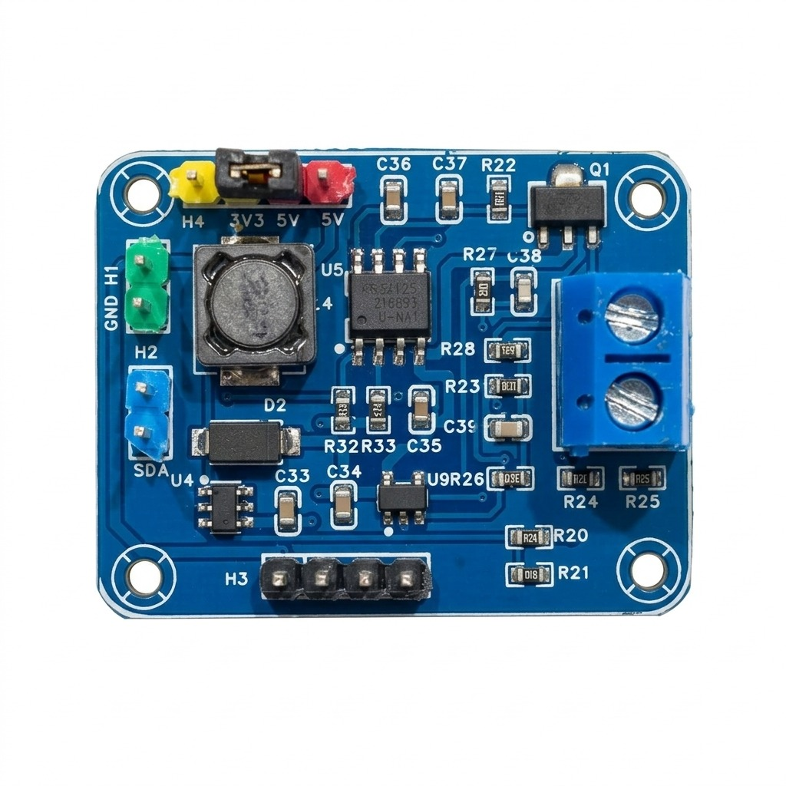
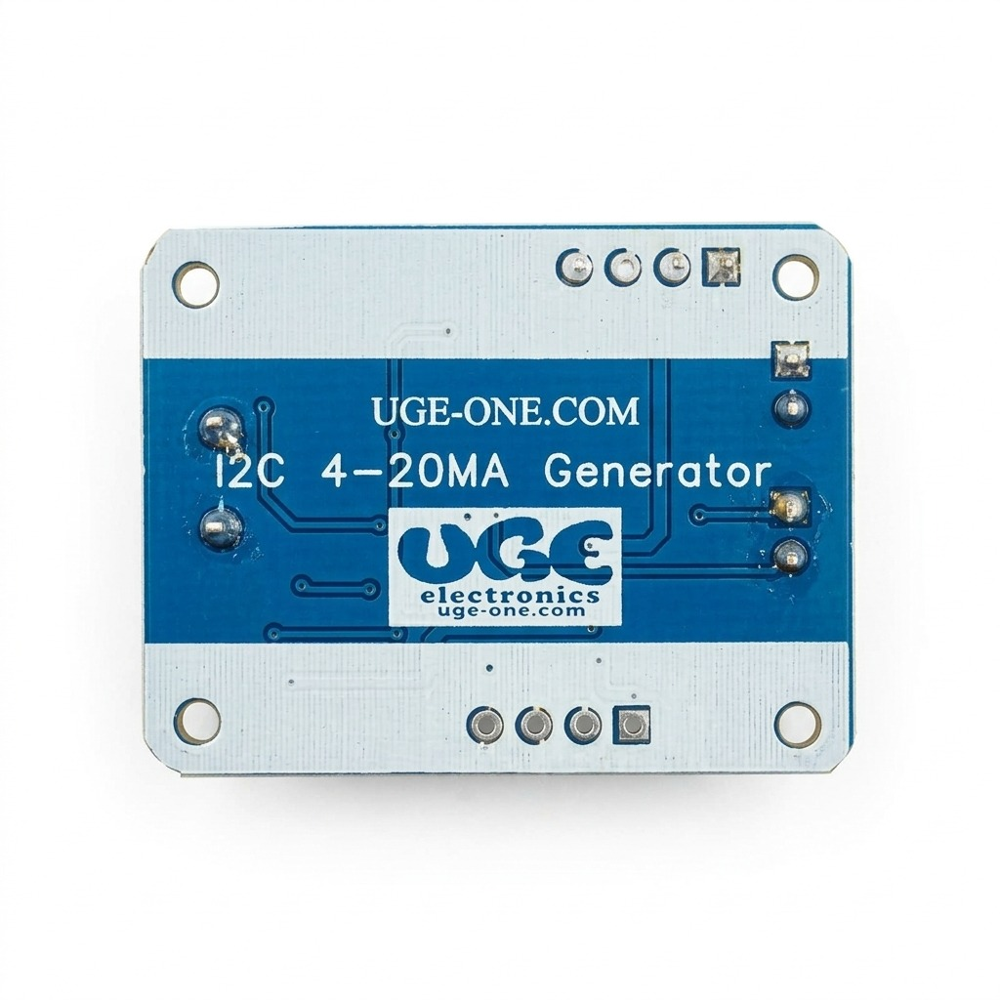
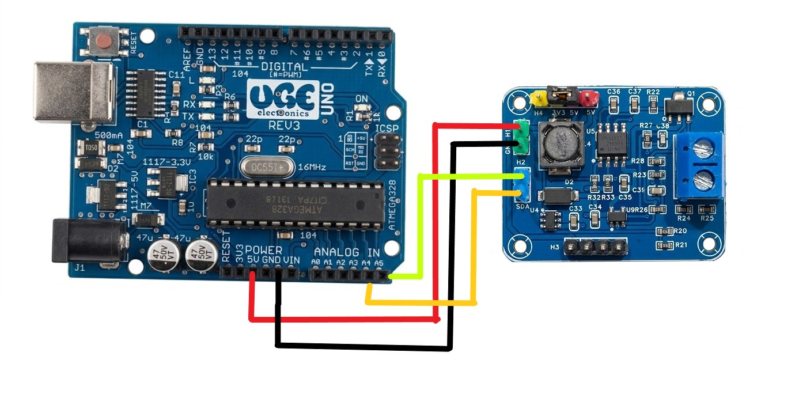

# UGE GP8212S 4–20 mA Current Loop Generator Module

Compact **I²C-controlled** analog output board based on the Linearin **GP8212S-TC50-EW** (15-bit DAC → industrial **0 / 4–20 mA** current loop).

**[Open interactive BOM ↗](https://ugeelectronics.github.io/UGE-GP8212S-CurrentLoop-Generator-Module/GP8212SBOM.html)** — browser BOM for soldering / identifying parts (do not use the GitHub `.html` file viewer).

<p align="center">
  
</p>

<p align="center">
  
</p>

| | |
|---|---|
| **Chip** | GP8212S-TC50-EW (ESOP-8), 15-bit I²C |
| **Output** | 0–25 mA full scale (typical with Rs = 100 Ω); use 4–20 mA for industrial loops |
| **Interface** | I²C address **0x58**, logic **2.7–5.5 V** (Arduino & ESP32 friendly) |
| **Module power** | **5 V** input → onboard **MT3608** boost → ~**12 V** for the DAC |
| **MCU examples** | Arduino / ESP32 library in this repo; STM32 bit-bang reference included |
| **Interactive BOM** | **[Open in browser](https://ugeelectronics.github.io/UGE-GP8212S-CurrentLoop-Generator-Module/GP8212SBOM.html)** |

---

## Buy

| Item | Link |
|------|------|
| **GP8212S chip only** | [uge-one.com — GP8212S-TC50-EW](https://uge-one.com/product/gp8212s-tc50-ew-15-bit-i%c2%b2c-to-4-20ma-dac-ic-esop-8/) |
| **Empty bare PCB** | [uge-one.com — PCB for I2C 4–20 mA generator](https://uge-one.com/product/pcb-for-i2c-4-20ma-generator-module/) |
| **Interactive BOM** | **[Open live BOM](https://ugeelectronics.github.io/UGE-GP8212S-CurrentLoop-Generator-Module/GP8212SBOM.html)** |

Assembled modules: contact [UGE Electronics](https://uge-one.com/).

---

## Repository layout

```text
software/GP8212S/     Arduino & ESP32 library + examples
docs/                 GitHub Pages site + interactive BOM + images
hardware/             Link to the live BOM (GitHub code view cannot render HTML)
stm32_reference/      Original STM32F10x bit-bang I²C (MyI2C)
```

---

## Quick start (Arduino / ESP32)

### 1. Install the library

**Option A — manual**

1. Download this repository (Code → Download ZIP) or clone it.
2. Copy the folder `software/GP8212S` into your Arduino libraries directory:
   - Windows: `Documents\Arduino\libraries\GP8212S`
   - macOS: `~/Documents/Arduino/libraries/GP8212S`
   - Linux: `~/Arduino/libraries/GP8212S`
3. Restart the Arduino IDE.

**Option B — ZIP**

Sketch → Include Library → Add .ZIP Library… and select a ZIP that contains the `GP8212S` folder (with `library.properties` at its root).

### 2. Wire the module

<p align="center">
  
</p>

| Module | Arduino Uno / Nano | ESP32 (typical) | Notes |
|--------|--------------------|-----------------|-------|
| **5 V** (H1) | 5 V | 5 V-capable supply | Powers MT3608 → ~12 V for the DAC |
| **GND** (H1) | GND | GND | Common ground |
| **SCL** (H2) | A5 | GPIO 22 | I²C clock |
| **SDA** (H2) | A4 | GPIO 21 | I²C data |
| **IOUT** (blue terminal) | — | — | Loop output — connect load / meter here |

- Share **GND** between MCU and module.
- Do **not** feed the GP8212S chip `VCC` pin from USB 5 V directly — use the module’s **5 V** input so the MT3608 can boost to ~12 V.
- I²C works at **3.3 V** (ESP32) or **5 V** (classic Arduino).

<p align="center">
  
</p>

### 3. Minimal sketch

```cpp
#include <Wire.h>
#include <GP8212S.h>

GP8212S dac;  // I2C 0x58, 25 mA full scale (Rs = 100 Ω)

void setup() {
  Serial.begin(115200);

#if defined(ESP32)
  if (dac.begin(21, 22) != 0) {   // SDA, SCL
#else
  if (dac.begin() != 0) {
#endif
    Serial.println("GP8212S not found");
    while (true) {}
  }

  dac.setCurrent_mA(12.0);     // milliamps
  // After one-time calibration, paste your line from "apply":
  // dac.calibrate4_20(5200, 26200);
  // dac.setPercent4_20(50);   // 0–100% of 4–20 mA span
  // dac.setDAC(0x3D70);       // raw 15-bit code
}

void loop() {}
```

### 4. Examples

After install: **File → Examples → GP8212S**

| Example | What it does |
|---------|----------------|
| **CurrentSweep** | Sweeps 4 → 20 → 4 mA |
| **SetAndStore** | Set mA from Serial; optional NVM `store()` |
| **Calibrate4_20** | Interactive two-point calibration with a meter |

---

## API overview

| Method | Description |
|--------|-------------|
| `begin(sda, scl, freq)` | Init I²C and probe (returns `0` on ACK) |
| `setCurrent_mA(mA)` | Output current in mA (0 … full scale) |
| `setPercent4_20(pct)` | 0% → 4 mA, 100% → 20 mA |
| `setDAC(code)` | Raw 15-bit code `0 … 0x7FFF` |
| `calibrate4_20(dac4, dac20)` | Use measured codes for accurate 4–20 mA |
| `store(sda, scl)` | Save last DAC value in chip NVM (survives power-off) |

Ideal codes with **Rs = 100 Ω** (0–25 mA full scale):

| Current | Approx. DAC |
|---------|-------------|
| 4 mA | 5243 (`0x147A`) |
| 12 mA | 15728 (`0x3D70`) |
| 20 mA | 26214 (`0x6666`) |
| 25 mA | 32767 (`0x7FFF`) |

Datasheet: `IOUT = (2.5 V / Rs) × (DATA / 0x7FFF)`.

---

## Calibration (recommended — once per board)

You do **not** repeat this on every power-on. Run it once, then paste `dac.calibrate4_20(...)` into your sketches.

### What you need

- Arduino (or ESP32) + this module wired as above  
- **~330 Ω** load on the blue **IOUT** terminal (**1 W preferred**)  
- DMM measuring the **actual loop current** through that resistor  

### Steps

1. Upload **Examples → GP8212S → Calibrate4_20**.
2. Open **Serial Monitor** at **115200** (line ending: **Newline**).
3. Type **`4`**  
   Read the meter (example: **8.08 mA**).  
   Type **`M 8.08`** — the sketch rescales to 4 mA and **auto-saves** the 4 mA point.
4. Type **`20`**  
   Read the meter (example: **25.63 mA**).  
   Type **`M 25.63`** — rescales to 20 mA and **auto-saves** the 20 mA point.
5. Type **`apply`**. You get a line like:

```cpp
dac.calibrate4_20(5200, 26200);
```

6. Put that line in `setup()` **after** `dac.begin(...)` in all future code for this board.

Optional fine trim before `apply`: `+++` `---` (±2000), `++` `--` (±500), `+` `-` (±50), `]` `[` (±5). Commands are case-insensitive (`m` / `M`).
---

## Hardware & soldering

<p align="center">
  
</p>

### Interactive BOM (opens in the browser)

GitHub’s file viewer only shows HTML **source**. Use one of these instead:

| | |
|---|---|
| **Live page (recommended)** | [Open interactive BOM](https://ugeelectronics.github.io/UGE-GP8212S-CurrentLoop-Generator-Module/GP8212SBOM.html) |
| **Docs home** | [ugeelectronics.github.io/…/](https://ugeelectronics.github.io/UGE-GP8212S-CurrentLoop-Generator-Module/) |
| **Offline** | Download [`docs/GP8212SBOM.html`](docs/GP8212SBOM.html) and double-click it |

> **First-time Pages setup (repo admins) — required once:**  
> 1. Open **Settings → Pages**  
> 2. Under **Build and deployment → Source**, choose **Deploy from a branch**  
> 3. Branch: **main**, folder: **/docs** → **Save**  
> 4. Wait about a minute, then open the live BOM link above.

---

## STM32 reference

[`stm32_reference/MyI2C.c`](stm32_reference/MyI2C.c) is the original **STM32F10x open-drain bit-bang I²C** layer (no high-level DAC API). The Arduino library replaces that with `Wire` and implements the GP8212S register write / store sequence.

---

## Notes & limits

- Default I²C address: **`0x58`**.
- Chip `VCC` range per datasheet: **9–36 V**; this module uses ~**12 V** from MT3608 after **5 V** input.
- Max load resistance shrinks at 12 V vs 24 V — keep calibration / field loads in the **~220–330 Ω** range unless you raise the boost voltage within safe design limits.
- There is **no official Arduino library named GP8212S** from the chip vendor; DFRobot’s [GP8XXX](https://github.com/DFRobot/DFRobot_GP8XXX) covers related parts (e.g. GP8211S / GP8302) but not this module. Use **UGE `GP8212S`** here.

---

## License

MIT — see [LICENSE](LICENSE).  
© 2026 UGE Electronics — [uge-one.com](https://uge-one.com/)
